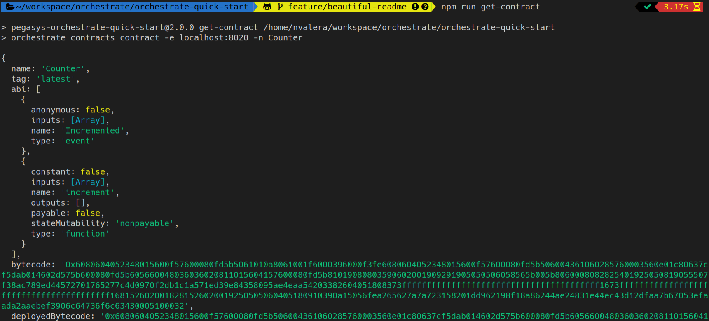

<p align="center">
  
</p>

# PegaSys Orchestrate Quick-Start

PegaSys Orchestrate is a platform that enables enterprises to easily build secure
and reliable applications on Ethereum blockchains.

It provides advanced features to connect to blockchain networks:

- Transaction management (transaction crafting, gas management, nonce management, transaction listening...)
- Account management with private key storage in Hashicorp Vault
- Smart Contract Registry
- Multi-chain & Multi-protocol (public or private)

For more information please refer to [PegaSys Orchestrate official Documentation](https://docs.orchestrate.pegasys.tech/).

During this quick-start you will manipulate:

- Orchestrate Command Line Interface (through npm scripts),
- Orchestrate REST API using Curl,
- Orchestrate SDK using Node Javascript samples.

## Requirements

- Run this Quickstart on a Linux or macOS machine,
- Have access to the Orchestrate Docker registry:
  login credentials can be requested as indicated in the [Login on Docker registry](#login-on-docker-registry) step,
- [Docker version >= 18](https://www.docker.com/) installed and running and [Docker-compose](https://docs.docker.com/compose/install/) installed,
- [Node.js version >=10 and NPM](https://nodejs.org/en/) installed.
- [Curl](https://curl.haxx.se/download.html) command installed.
- All other Ethereum client on your computer stopped if you want to make sure not to have port conflicts.

### Network requirement

This quickstart has to connect to a blockchain network.
You can use the default local Hyperledger Besu network provided by this quickstart or
provide an external one like and Infura project.

#### Local Besu network

A local Besu network using CLique is included by default in this quickstart.
There's no specific requirement to run this network.

#### External network

The requirements for an external network is to have the network RPC endpoint address.
You can use Infura with an [infura.io](https://infura.io/) account
and a Rinkeby project ID. Refer to this ["Getting Started With Infura" blog post](https://blog.infura.io/getting-started-with-infura-28e41844cc89/) for more details.

## Step 1 - Set-up and run Orchestrate

### Clone project

```bash
git clone https://github.com/PegaSysEng/orchestrate-quick-start.git
```

### Login on Docker registry

If you are running Orchestrate for the first time you need to login on Orchestrate Docker registry.

Request access on [Pegasys Zendesk support site](http://pegasys.zendesk.com/)
(create an account with your email address or login with an existing one) or by sending an email to [support@pegasys.tech](mailto:support@pegasys.tech). Pegasys will contact you to provide this access.

> **Important:** _When you receive these credentials from Pegasys, you can continue this Quickstart
> and connect to the registry from your terminal._
>
> **You can't continue without the registry credentials.**

```bash
docker login -u <username> -p <password> consensys-docker-pegasys-orchestrate.bintray.io
```

### Select the environment

You have to choose an environment to run this quickstart.

Depending on the network that you want to use:

- A local Hyperledger Besu Clique network
- An Infura Rinkeby network.

**copy one of the example environment files `.env.besu.example`
or `.env.infura-rinkeby.example` to a `.env` file at the root of the project.**

> **Important:** _if you used Infura example for your `.env` file, replace the `NETWORK_ENDPOINT` value by the correct
> Infura endpoint, including your Infura network project ID._

You will have to define some other variables in this `.env` file later. Using the same `.env`
file all along this quickstart will help you to have a consistent experience.

### Run Orchestrate Quickstart

Orchestrate Quickstart is based on a Docker compose setup and includes Orchestrate services
as well as other services from Docker images including Kafka, Redis, Postgres and Hashicorp Vault and an Hyperledger Besu node.

- You can find details on the way dependent services are setup in [dependencies docker-compose.yml](scripts/deps/docker-compose.yml) file.
- You can find details on the way Besu node is setup in [Besu docker-compose-besu.yml](scripts/deps/docker-compose-besu.yml) file.
- Orchestrate micro-services are configured in [main docker-compose.yml](docker-compose.yml) file.

Run the quickstart with the following command:

```bash
npm run up
```


> **Note:** _If you want to stop Orchestrate you can run `npm run down` it will stop all container and remove all data volumes_

### Install Orchestrate CLI

```bash
npm install
```

Verify that CLI is properly installed and list all commands by running:

```bash
npm run orchestrate help
```

To access details of each command:

```bash
npm run orchestrate [cmd] help
```

**Example:** `npm run orchestrate contracts help`

## Step 2 - Create a blockchain account

### Create account

Use Orchestrate CLI to generate an account.

```bash
npm run generate-account
```


You will use this account as your network faucet.

**Copy the address and write it in the `.env` files as the `FAUCET_ACCOUNT` variable.**

Example: `FAUCET_ACCOUNT=0x6230592812dE2E256D1512504c3E8A3C49975f07`

### List accounts stored in Hashicorp Vault

You can run the Hashicorp account listing command to check what account is already generated for
your Orchestrate setup.

```bash
npm run hashicorp-accounts
```


You can run any [Hashicorp Vault CLI command](https://www.vaultproject.io/docs/commands/) by running
`npm run hashicorp-vault` followed by the command:

```bash
npm run hashicorp-vault -- <command>
```

For example, to display the [vault token](https://www.vaultproject.io/docs/concepts/tokens), run:

```bash
npm run hashicorp-vault -- token lookup
```

## Step 3 - Connect a blockchain network

### Register a blockchain network

Now that you have Orchestrate up and running and a first account created,
it's time to connect it to a blockchain network.

Use Orchestrate RPC API to register a blockchain network.

> **Note:** _To make this quickstart easy, we provide an NPM command to register the network using the variables in the `.env` file.
> Under the hood, it's a Curl post request to Orchestrate REST API.
> Have a look at the `package.json` file for details on this command._

```bash
npm run register-chain
```

In the JSON result, **copy the chain unique identifier `uuid` and paste it in the `.env` files
as the value for the `CHAIN_UUID` variable.**

Example: `CHAIN_UUID=8a4d0093-c2b7-459b-af2a-8992aa145041`


> **Note:** _Depending on the network environment file you chose in the previous steps, you will connect
> Orchestrate to a private local Besu network or to Rinkeby through [Infura](https://infura.io/).
> But you can connect Orchestrate to any Ethereum network using its RPC endpoint._

### Send a JSON-RPC request through blockchain proxy

Verify that chain JSON-RPC is properly proxied by Orchestrate.

> **Note:** _Here we run a Curl command with an RPC call to ease this quickstart.
> Have a look at the `package.json` file for details on this command._

```bash
npm run get-latest-block
```


## Step 4 - Configure a faucet

> **Note:** _On non zero gas price networks (e.g. public networks such as Ethereum mainnet or Rinkeby
> but also some private networks like the Besu one used in this quickstart),
> an Ethereum account must have a positive ETH balance to pay fees for its transactions to be mined.
> Orchestrate provides a faucet that allows to automatically provide the required amount of ETH to accounts managed by Orchestrate_

### Create the faucet on Orchestrate

Use Orchestrate API to configure a faucet.

A faucet is defined using a name, a creditor account that will be used to credit other accounts and a chain identified by its UUID.
See [Orchestrate faucet configuration documentation](https://docs.orchestrate.pegasys.tech) for more detail.

The following command will use the `CHAIN`, `CHAIN_UUID` and `FAUCET_ACCOUNT` values from the `.env` file to create a faucet
called with the chain name suffixed by "-faucet".

```bash
npm run create-faucet
```


### Send ETH to the faucet account

> **Warning:** _In order to credit other addresses, faucet account must be credited with some ETH_

The recommended approach is to credit faucet account by sending some ETH from one of your personal
Rinkeby account using [MetaMask](https://metamask.io/) (1 ETH is enough).
If not familiar with MetaMask you can refer to the following [article about using Metamask](https://medium.com/openberry/getting-started-with-metamask-b9ac23a10c83).


If you do not have any Rinkeby test ETH, you can request some for free from an [official faucet](https://faucet.rinkeby.io/).

On the quickstart Besu local network, some accounts already have ETH.

You can transfer ETH form one of these test accounts as explained in
the [Hyperledger Besu "accounts for testing" documentation](https://besu.hyperledger.org/en/stable/Reference/Accounts-for-Testing/).

Connect Metamask to `http://localhost:8545` and transfer 1 or 2 ETH from one of these test addresses to
your `FAUCET_ACCOUNT` address.

## Step 5 - Register a smart contract

Orchestrate provides a contract registry.

You will be able to use this registry to deploy contracts on your registered networks.

But first you have to create, compile and add your contract to the registry.

### Compile the smart contract

```bash
npm run compile
```


_Quickstart uses [Truffle Suites](https://www.trufflesuite.com/) for compilation._

> **Note:** _This Quick Start provides a simple Solidity smart contract [Counter.sol](smart-contracts/Counter.sol)
> which is only for demonstration purpose. It simply increments an integer value._

### Push the smart contract to Orchestrate Contract Registry

```bash
npm run register-contract
```


### List smart contracts stored in Orchestrate Contract Registry

```bash
npm run get-catalog
```


### Get details about a smart contract

```bash
npm run get-contract
```



## Step 6 - Create an account to send transactions

Generate a new account that will be used to send transactions to the smart contact. This account will be generated and stored by the Hashicorp Vault service.

```bash
npm run generate-account
```


**Copy the generated account address and set the `FROM_ACCOUNT` value with this address in `.env` file.**

**Note:** _This account will be automatically funded by the faucet service configured previously._

If using Rinkeby, you can verify that the account has been properly funded by the faucet using [Etherscan Rinkeby explorer](https://rinkeby.etherscan.io/). Search for the account address in the main search field.


## Step 7 - Deploy a smart contract and send transactions

### Listen to transaction receipts events

Orchestrate manages blockchain transactions that are asynchronous by nature due to blockchain mining time. Orchestrate provides an event consumer to process transaction receipts when they are generated.

Orchestrate uses [Apache Kafka](https://kafka.apache.org/) to handle these asynchronous communications.

In the next steps, we are going to send two kinds of transactions:

- One transaction to create the contract on the chain,
- another to interact with this contract.

You have to run a consumer script to listen to these transactions receipts events and see them happen on the network.

On your current terminal, start the consumer and let the consumer run on foreground by keeping the terminal opened:

```bash
npm run consume
```

> **Reference script:** [consume.ts](src/consume/consume.ts)


### Deploy the Smart Contract

On a second terminal, in the same project directory, run the smart contract deploy command:

```bash
npm run deploy
```

After a few seconds (depending on blocktime) you should see the receipt related to the contract creation transaction in the consumer terminal.


If using Rinkeby, you can verify that the contract was deployed by using [Etherscan Rinkeby explorer](https://rinkeby.etherscan.io) and searching for the sender address.


**Set the `TO_ACCOUNT` value in `.env` file with the address of the deployed contract.
The value to copy is displayed in the receipt as `contractAddress`.**

### Send a transaction to the smart contract

> **Important:** _Before moving forward make sure that `FROM_ACCOUNT` and `TO_ACCOUNT` are set in `.env` file._

On the second terminal, run the transaction sending command:

```bash
npm run send-tx
```

After a few seconds (depending on blocktime) the transaction receipt will appear in the consumer output on the first terminal.


If using Rinkeby, you can verify that the transaction was been sent using [Etherscan Rinkeby explorer](https://rinkeby.etherscan.io) and searching for the sender address.


## Last step - Shut down the quickstart and remove data

Stop the consumer script by using `ctrl+C` in the terminal window where this script runs.

Stop the quickstart services and network by running the `npm run down` command.
