<p align="center">
  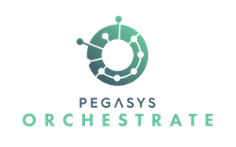
</p>

# PegaSys Orchestrate Quickstart

PegaSys Orchestrate is a platform that enables enterprises to easily build secure
and reliable applications on Ethereum blockchains.

> **Important:** Pegasys Orchestrate Quickstart is only available for Orchestrate customers and
> PegaSys partners.
>
> [Contact PegaSys](https://pegasys.tech/contact/) if you want to purchase Orchestrate or are interested in our partner program.
>
> If you are already a partner or customer but we did not provide the credentials to access the
> Docker registry, request access on [Pegasys Zendesk support site](http://pegasys.zendesk.com/)
> To access Pegasys Zendesk, create an account with your company email or login using an existing Pegasys Zendesk account.
> Alternatively, send an email from your company email to [support@pegasys.tech](mailto:support@pegasys.tech).
>
> You can use this Quickstart only if you have received these credentials from Pegasys to connect to the registry.
>
> **You cannot continue without the registry credentials.**

Orchestrate provides advanced features when connected to blockchain networks:

- Transaction management (transaction crafting, gas management, nonce management, and transaction listening)
- Account management with private key storage in Hashicorp Vault
- Smart contract registry
- Public and private transactions
- Multi-chain.

For more information, refer to the [PegaSys Orchestrate official Documentation](https://docs.orchestrate.pegasys.tech/).

During this quick-start you use:

- Orchestrate command line interface using npm scripts.
- Orchestrate REST API using Curl.
- Orchestrate SDK using Node Javascript samples.

## Requirements

- Run this Quickstart on a Linux or macOS machine.
- Have access to the [Orchestrate Docker registry](#login-on-docker-registry).
- [Docker version >= 18](https://www.docker.com/) installed and running and [Docker-compose](https://docs.docker.com/compose/install/) installed.
- [Node.js version >=10 and NPM](https://nodejs.org/en/) installed.
- [Curl](https://curl.haxx.se/download.html) installed.

> **Tip:** _To avoid port conflicts, stop other Ethereum clients on your computer before starting
> this quickstart._

### Network requirement

The quickstart connects to a blockchain network. You can use the default local Hyperledger Besu network
provided by this quickstart or provide an external one, such as an Infura project.

#### Local Besu network

A local Besu network using Clique is included in this quickstart.
If using the local Besu network, there are no specific requirements to run this network.

#### External network

To use an external network, you must have the network RPC endpoint address.

You can use Infura with an [infura.io](https://infura.io/) account and a Rinkeby project ID.
For more details, refer to [_Getting Started With Infura_](https://blog.infura.io/getting-started-with-infura-28e41844cc89/).

## Set up and run Orchestrate

### Clone project

```bash
git clone https://github.com/PegaSysEng/orchestrate-quick-start.git
```

### Install project dependencies

```bash
npm install
```

### Login on Docker registry

If you are running Orchestrate for the first time, you must login to the Orchestrate Docker registry using the credentials that you received as a partner or customer.

```bash
docker login -u <username> -p <password> consensys-docker-pegasys-orchestrate.bintray.io
```

### Initialize Orchestrate services

The Orchestrate Quickstart uses a Docker compose setup and includes Orchestrate services, as well as other services including Kafka, Redis, Postgres and Hashicorp Vault, and an Hyperledger Besu node.

- Orchestrate's dependent services are configured in the [dependencies docker-compose.yml file](scripts/deps/docker-compose.yml).
- Orchestrate services are configured in [main docker-compose.yml file](docker-compose.yml).
- The Besu node is configured in the [Besu docker-compose-besu.yml file](scripts/deps/docker-compose-besu.yml).

To initialize Orchestrate execute:

```bash
npm run up
```

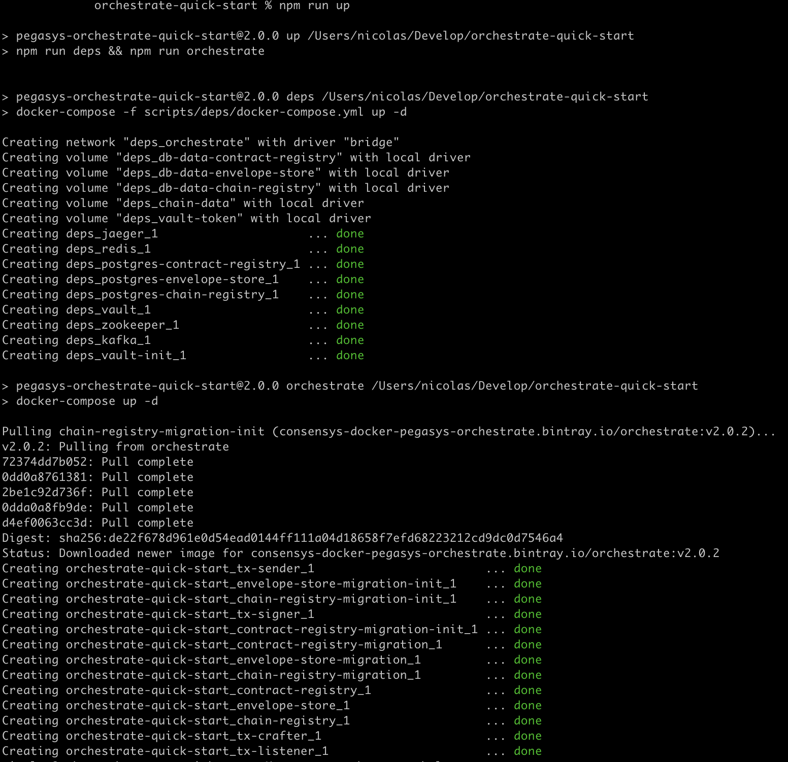

> **Note:** _To stop Orchestrate, run `npm run down`._ > _stops all containers and removes all data volumes._

Optionally to initialize a Besu node you have to execute:

```bash
npm run up-besu
```

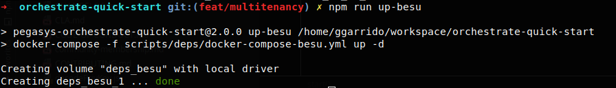

> **Note:** _To stop Besu, run `npm run down-besu`._ > _stops besu containers and removes all data volumes._

### Install Orchestrate command line interface (CLI)

Verify that the CLI is properly installed and list all commands:

```bash
npm run orchestrate help
```

To access details of each command:

```bash
npm run orchestrate [cmd] help
```

**Example:** `npm run orchestrate contracts help`

### Copy the environment file

Depending on the network that you want to use:

- A local Hyperledger Besu Clique network
- An Infura Rinkeby network.

Copy the example environment files (`.env.besu.example`
or `.env.infura-rinkeby.example`) to a `.env` file at the root of the project.

> **Important:** _If using Infura, replace the `NETWORK_ENDPOINT` value in your `.env` file with the
> correct Infura endpoint, including your Infura network project ID._

You will define some other variables in this `.env` file later. Using the same `.env`
file throughout enables a consistent experience.

## Tutorial

## Step 1 - Create an Ethereum account

### Create account

Use the Orchestrate CLI to generate an account:

```bash
npm run generate-account
```

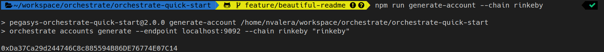

We use this account as your network faucet.

### Copy account address

Copy the address and include it in the `.env` files as the `FAUCET_ACCOUNT` variable.

Example: `FAUCET_ACCOUNT=0x6230592812dE2E256D1512504c3E8A3C49975f07`

### List accounts stored in Hashicorp Vault

To view available accounts, run the `hashicorp-accounts` command:

```bash
npm run hashicorp-accounts
```

> **Note:** Each account is prefix by its corresponding tenantID, by default is '\_'

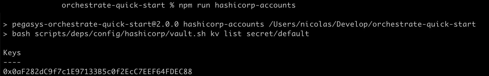

### Run Hashicorp Vault commands

Run any [Hashicorp Vault CLI command](https://www.vaultproject.io/docs/commands/) by running
`npm run hashicorp-vault` followed by the command:

```bash
npm run hashicorp-vault -- <command>
```

For example, to display the [vault token](https://www.vaultproject.io/docs/concepts/tokens):

```bash
npm run hashicorp-vault -- token lookup
```

## Step 2 - Connect to a blockchain network

### Register a blockchain network

Now that you have Orchestrate up and running and an account created,
it's time to connect Orchestrate to a blockchain network.

Use the Orchestrate REST API to register a blockchain network:

```bash
npm run register-chain
```

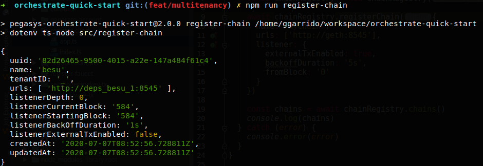

The chain unique identifier (`uuid`) is displayed in the JSON result.

> **Note:** _To make this quickstart easy, we provide an NPM command to register the network using
> the variables in the `.env` file.
> Under the hood, it's a Curl post request to Orchestrate REST API.
> Have a look at the `package.json` file for details on this command._

### Copy chain unique identifier

Copy the chain unique identifier `uuid` and paste it into your `.env` file
as the value for the `CHAIN_UUID` variable.

Example: `CHAIN_UUID=8a4d0093-c2b7-459b-af2a-8992aa145041`

> **Note:** _Depending on the network environment file you chose earlier, you connect your Orchestrate
> instance to a private local Besu network or to Rinkeby through [Infura](https://infura.io/).
> You can connect Orchestrate to any Ethereum network using the network RPC endpoint._

### Send a JSON-RPC request through blockchain proxy

Verify that the chain JSON-RPC is being proxied by Orchestrate:

```bash
npm run get-latest-block
```

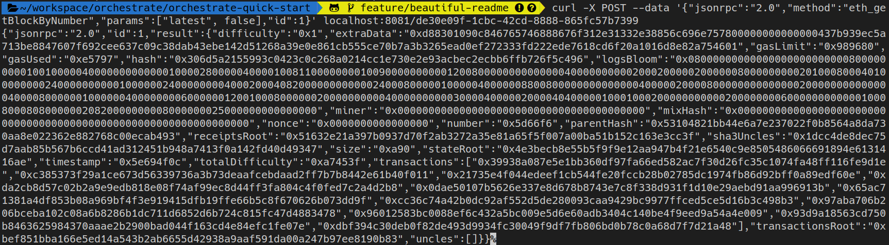

> **Note:** _As with creating a chain, we provide an NPM command to make the request.
> Have a look at the `package.json` file for details on this command._

## Step 3 - Configure a faucet

> **Note:** _On paid gas networks (for example, public networks such as Ethereum mainnet or Rinkeby
> and also some private networks, such as the Besu one used in this quickstart),
> an Ethereum account must have a positive ETH balance to pay transactions fees for mining.
> Orchestrate provides a faucet to enable automatically providing the required ETH to accounts
> managed by Orchestrate_

### Create the faucet on Orchestrate

A [faucet](https://docs.orchestrate.pegasys.tech) is defined using a name, a creditor account used
to credit other accounts, and a chain identified by its UUID.

The following command uses the `CHAIN`, `CHAIN_UUID` and `FAUCET_ACCOUNT` values from the `.env` file to create a faucet.
The faucet is called with the chain name suffixed by `-faucet`.

Use the Orchestrate API to configure a faucet:

```bash
npm run create-faucet
```


### Send ETH to the faucet account

> **Important:** _In order to credit other addresses, the faucet account must have some ETH._

If you're not familiar with MetaMask, refer to this [article about getting started with Metamask](https://medium.com/openberry/getting-started-with-metamask-b9ac23a10c83).

#### Local Besu network

On the quickstart Besu local network, some [pre-defined accounts are configured with an ETH balance](scripts/deps/config/besu/genesis.json).

Connect Metamask to `http://localhost:8545` and import one of the genesis account privatekeys and transfer 1 or 2 ETH from one of the test accounts to
your `FAUCET_ACCOUNT` address.

#### Rinkeby

If connected to Rinkeby, the recommended approach is to credit the faucet account by transferring 1 or 2 ETH from one of your personal
Rinkeby accounts using [MetaMask](https://metamask.io/).

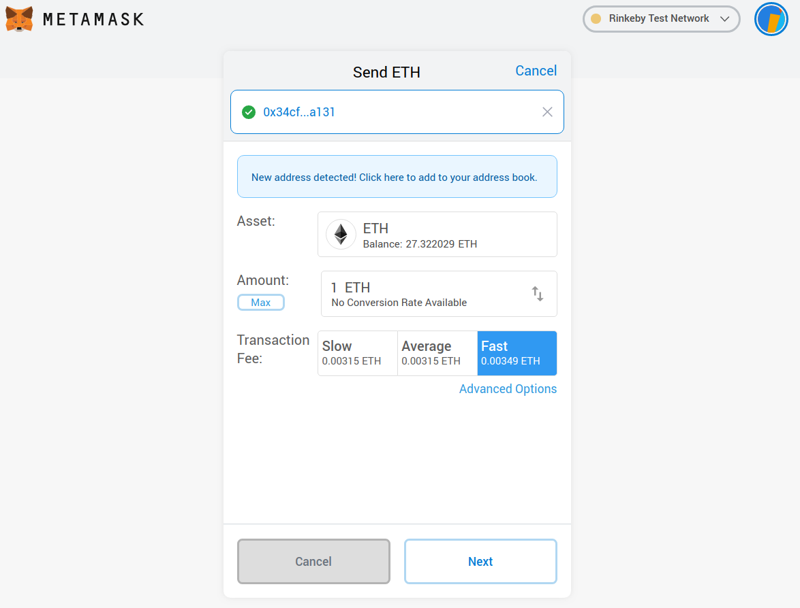

If you do not have any Rinkeby test ETH, you can request some for free from an [official Rinkeby faucet](https://faucet.rinkeby.io/).

## Step 4 - Register a smart contract

Orchestrate provides a contract registry.

You can use this registry to deploy contracts on your registered networks.
But first you have to create, compile, and add your contract to the registry.

### Compile the smart contract

```bash
npm run compile
```

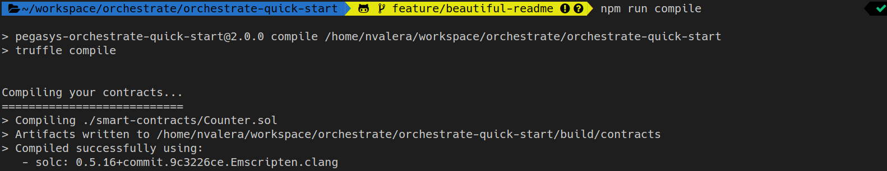

_The Orchestrate Quickstart uses [Truffle](https://www.trufflesuite.com/) for compiling._

> **Note:** _The Quickstart provides a basic Solidity smart contract [Counter.sol](smart-contracts/Counter.sol)
> for demonstration purpose. The contract only increments an integer value._

### Push the smart contract to the Contract Registry

```bash
npm run register-contract
```

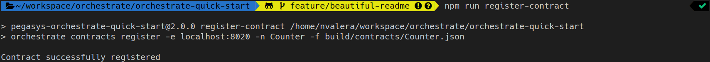

### List smart contracts stored in the Contract Registry

```bash
npm run get-catalog
```

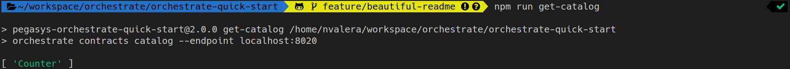

## Step 5 - Create an account to send transactions

Generate an account to be used for sending transactions to the smart contact.
The generated account is stored by the Hashicorp Vault service.

```bash
npm run generate-account
```

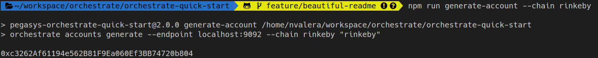

**Note:** _The generated account is automatically funded by the faucet service configured previously._

### Copy account addresss

Copy the generated account address and set the `FROM_ACCOUNT` value with this address in `.env` file.

### Verify Rinkeby account funded

If using Rinkeby, you can verify that the account has been properly funded by the faucet using
[Etherscan Rinkeby explorer](https://rinkeby.etherscan.io/).
Search for the account address in the main search field.

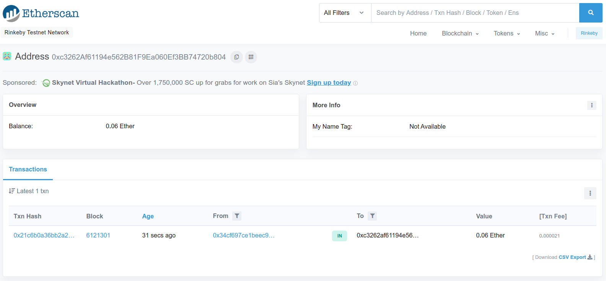

## Step 6 - Deploy a smart contract and send transactions

### Listen to transaction receipts events

Orchestrate manages blockchain transactions that are asynchronous by nature due to blockchain mining time.
Orchestrate provides an event consumer to process transaction receipts when they are generated.

Orchestrate uses [Apache Kafka](https://kafka.apache.org/) to handle these asynchronous communications.

In the next steps, we send two kinds of transactions:

- Create the contract on the chain
- Interact with the contract.

You have to run a consumer script to listen to the transaction receipt events and see them happen on the network.

On your current terminal, start the consumer and let the consumer run on foreground by keeping the terminal:

```bash
npm run consume
```

> **Reference script:** [consume.ts](src/consume/consume.ts)

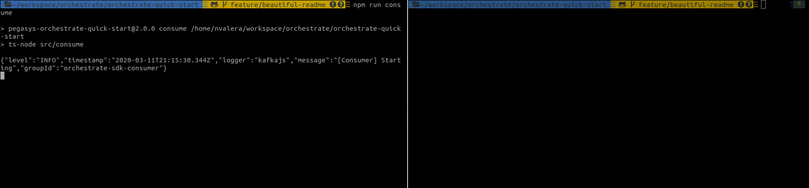

### Deploy the Smart Contract

On another terminal, in the same project directory, deploy the smart contract:

```bash
npm run deploy
```

After a few seconds (depending on block time), you see the receipt related to the contract creation transaction in the consumer terminal.

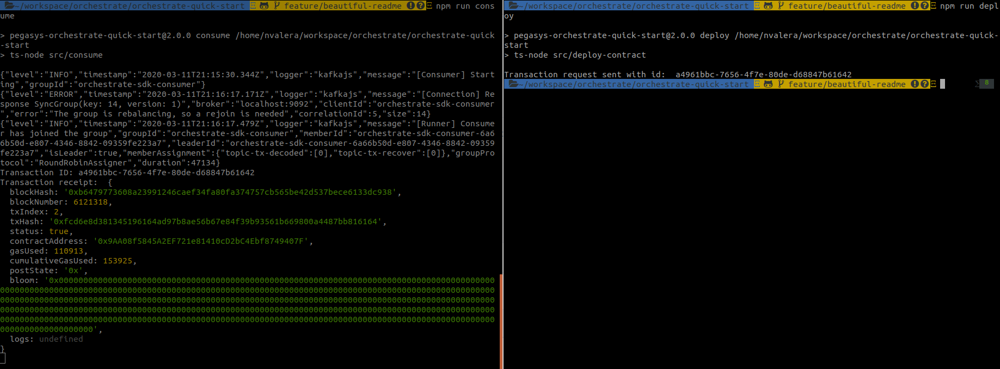

> **Note:**: You will be required to execute this command twice, first to fund your sender account with enough tokens, then another one to send the actual deploy contract transaction.

### Copy contract address

Copy the `contractAddress` in the receipt and set the `TO_ACCOUNT` value with this address in `.env` file.

### Verify Rinkeby contract deployed

If using Rinkeby, you can verify that the contract was deployed by using
[Etherscan Rinkeby explorer](https://rinkeby.etherscan.io) and searching for the sender address.

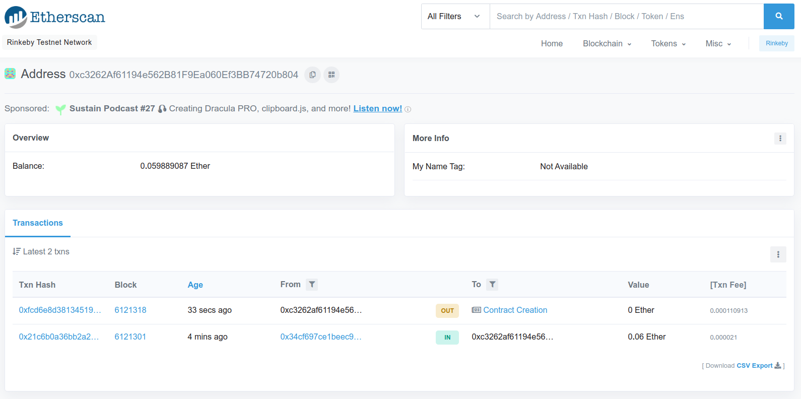

### Send a transaction to the smart contract

> **Important:** _Before moving forward, ensure the `FROM_ACCOUNT` and `TO_ACCOUNT` are set in the `.env` file._

On the second terminal, send the transaction:

```bash
npm run send-tx
```

After a few seconds (depending on block time), you see the transaction receipt in the consumer
output on the first terminal.

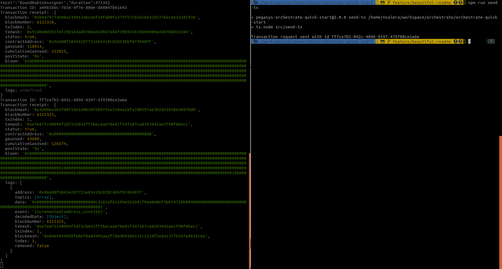

### Verify Rinkeby transaction

If using Rinkeby, you can verify the transaction was sent using
[Etherscan Rinkeby explorer](https://rinkeby.etherscan.io) and searching for the sender address.

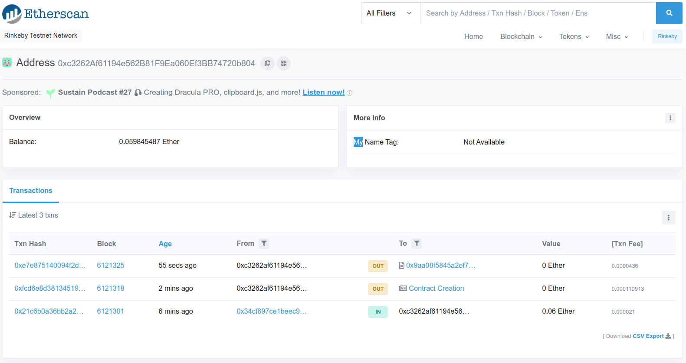

## Advanced Tutorial

### Multitenancy

Multi-tenancy enables serving multiple blockchain applications with a single Orchestrate instance. Resources including transaction streams, access to the blockchain network, private keys, and smart contracts are isolated to the tenant that owns them.
[See more](https://docs.orchestrate.pegasys.tech/en/latest/Concepts/Multi-Tenancy/)

Orchestrate uses the OpenID Connect(OIDC) authentication protocol. JSON Web Tokens (JWTs) with custom claims control access to tenant resources.

### Enabling multi-tenancy

To enable multi-tenancy we need to modify the following variable from our local environment file `.env` as follow:

```bash
MULTI_TENANCY_ENABLED=true
AUTH_TOKEN=
```

Then, we need to start Orchestrate again:

```bash
npm run down && npm run up
```

#### Using self-generated certificates

For the sake of simplicity Orchestrate team has provided a dev certificate
to encode and decode the generated JWT. In case you want to use your own certificates, generated for instance with `openssl`, you need to replace the following two ENV vars:

```
AUTH_JWT_CERTIFICATE=MIIDYjCCAkoCCQC9pJWk7qdipjANBgkqhkiG9w0BAQsFADBzMQswCQYDVQQGEwJGUjEOMAwGA1UEBwwFUGFyaXMxEjAQBgNVBAoMCUNvbnNlblN5czEQMA4GA1UECwwHUGVnYVN5czEuMCwGA1UEAwwlZTJlLXRlc3RzLm9yY2hlc3RyYXRlLmNvbnNlbnN5cy5wYXJpczAeFw0xOTEyMjcxNjI5MTdaFw0yMDEyMjYxNjI5MTdaMHMxCzAJBgNVBAYTAkZSMQ4wDAYDVQQHDAVQYXJpczESMBAGA1UECgwJQ29uc2VuU3lzMRAwDgYDVQQLDAdQZWdhU3lzMS4wLAYDVQQDDCVlMmUtdGVzdHMub3JjaGVzdHJhdGUuY29uc2Vuc3lzLnBhcmlzMIIBIjANBgkqhkiG9w0BAQEFAAOCAQ8AMIIBCgKCAQEAo0NqWqI3TSi1uOBvCUquclWo4LcsYT21tNUXQ8YyqVYRSsiBv+ZKZBCjD8XklLPih40kFSe+r6DNca5/LH/okQIdc8nsQg+BLCkXeH2NFv+QYtPczAw4YhS6GVxJk3u9sfp8NavWBcQbD3MMDpehMOvhSl0zoP/ZlH6ErKHNtoQgUpPNVQGysNU21KpClmIDD/L1drsbq+rFiDrcVWaOLwGxr8SBd/0b4ngtcwH16RJaxcIXXT5AVia1CNdzmU5/AIg3OfgzvKn5AGrMZBsmGAiCyn4/P3PnuF81/WHukk5ETLnzOH+vC2elSmZ8y80HCGeqOiQ1rs66L936wX8cDwIDAQABMA0GCSqGSIb3DQEBCwUAA4IBAQCNcTs3n/Ps+yIZDH7utxTOaqpDTCB10MzPmb22UAal89couIT6R0fAu14p/LTkxdb2STDySsQY2/Lv6rPdFToHGUI9ZYOTYW1GOWkt1EAao9BzdsoJVwmTON6QnOBKy/9RxlhWP+XSWVsY0te6KYzS7rQyzQoJQeeBNMpUnjiQji9kKi5j9rbVMdjIb4HlmYrcE95ps+oFkyJoA1HLVytAeOjJPXGToNlv3k2UPJzOFUM0ujWWeBTyHMCmZ4RhlrfzDNffY5dlW82USjc5dBlzRyZalXSjhcVhK4asUodomVntrvCShp/8C9LpbQZ+ugFNE8J6neStWrhpRU9/sBJx
AUTH_JWT_PRIVATE_KEY=MIIEvAIBADANBgkqhkiG9w0BAQEFAASCBKYwggSiAgEAAoIBAQCjQ2paojdNKLW44G8JSq5yVajgtyxhPbW01RdDxjKpVhFKyIG/5kpkEKMPxeSUs+KHjSQVJ76voM1xrn8sf+iRAh1zyexCD4EsKRd4fY0W/5Bi09zMDDhiFLoZXEmTe72x+nw1q9YFxBsPcwwOl6Ew6+FKXTOg/9mUfoSsoc22hCBSk81VAbKw1TbUqkKWYgMP8vV2uxur6sWIOtxVZo4vAbGvxIF3/RvieC1zAfXpElrFwhddPkBWJrUI13OZTn8AiDc5+DO8qfkAasxkGyYYCILKfj8/c+e4XzX9Ye6STkRMufM4f68LZ6VKZnzLzQcIZ6o6JDWuzrov3frBfxwPAgMBAAECggEARNLHg7t8SoeNy4i45hbYYRRhI5G0IK3t6nQl4YkslBvXIEpT//xpgbNNufl3OYR3SyMhgdWGWe0Ujga8T5sABBj7J3OIp/R3RJFx9nYewwIq8K5VFqNUJWyNYuF3lreEKQHp2Io+p6GasrGR9JjQ95mIGFwfxo/0Pdfzv/5ZhMWTmSTcOi504Vger5TaPobPFOnULq4y1A4eX4puiHDtvx09DUAWbAjGHpCYZjDGRdSXQArYQmUOKy7R46qKT/ollGOWivnEOgsFmXuUWs/shmcrDG4cGBkRrkxyIZhpnpNEEF5TYgulMMzwM+314e8W0lj9iiSB2nXzt8JhEwTz8QKBgQDSCouFj2lNSJDg+kz70eWBF9SQLrBTZ8JcMte3Q+CjCL1FpSVYYBRzwJNvWFyNNv7kHhYefqfcxUVSUnQ1eZIqTXtm9BsLXnTY+uEkV92spjVmfzBKZvtN3zzip97sfMT9qeyagHEHwpP+KaR0nyffAK+VPhlwNMKgQ9rzP4je+QKBgQDG/JwVaL2b53vi9CNh2XI8KNUd6rx6NGC6YTZ/xKVIgczGKTVex/w1DRWFTb0neUsdus5ITqaxQJtJDw/pOwoIag7Q0ttlLNpYsurx3mgMxpYY12/wurvp1NoU3Dq6ob7igfowP+ahUBchRwt1tlezn3TYxVoZpu9dZHtoynOtRwKBgB9vFJJYdBns0kHZM8w8DWzUdCtf0WOqE5xYv4/dyLCdjjXuETi4qFbqayYuwysfH+Zj2kuWCOkxXL6FOH8IQqeyENXHkoSRDkuqwCcAP1ynQzajskZwQwvUbPg+x039Hj4YQCCfOEtBA4T2Fnadmwn0wFJFiOkR/E6f2RSuXX2BAoGALvVqODsxk9s7B0IqH2tbZAsW0CqXNBesRA+w9tIHV2caViFfcPCs+jAORhkkbG5ZZbix+apl+CqQ+trNHHNMWNP+jxVTpTrChHAktdOQpoMu5MnipuLKedI7bPTT/zsweu/FhSFvYd4utzG26J6Rb9hPkOBx9N/KWTXfUcmFJv0CgYAUYVUvPe7MHSd5m8MulxRnVirWzUIUL9Pf1RKWOUq7Ue4oMxzE8CZCJstunCPWgyyxYXgj480PdIuL92eTR+LyaUESb6szZQTxaJfu0mEJS0KYWlONz+jKM4oC06dgJcCMvhgjta2KpXCm3qL1pmKwfFbOLWYBe5uMoHIn9FdJFQ==
```


### Generate JWT token

To generate a valid JWT we need to run the following command, where `TENANT_ID=` indicate the tenant id included in our token.

```
TENANT_ID=foo npm run generate-jwt
```

By default the _expiration time is 1h_, in case you want to modify you can use the ENV variable _EXPIRATION_. For instance, to make it 5 hours you execute:

```
EXPIRATION=5h TENANT_ID=foo npm run generate-jwt
```

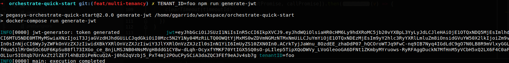

> **Note:** Decode the generated token using _[https://jwt.io/](https://jwt.io/)_ and verify the correct tenant is included within the selected namespace.

### How to test it

Once we obtain a valid token we just need to update _AUTH_TOKEN=_ from `.env` file. Going back to [tutorial](/#tutorial), if we follow the steps again, every request will be sent using the generated JWT.

> **Note:**: In some sample cases we need to prefix the token by `Bearer` to be correctly decoded by the Orchestrate services.
