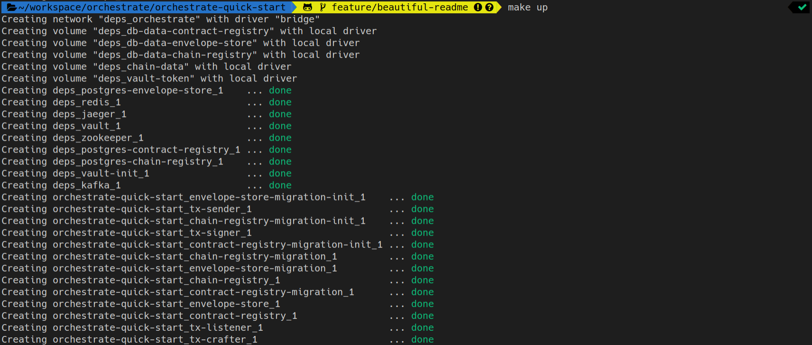

# PegaSys Orchestrate Quick Start

<p align="center">
  
</p>

PegaSys Orchestrate is a platform that enables enterprises to easily build secure and reliable applications on the Ethereum blockchain.

It provides all features to connect to blockchain networks

- Transaction Management (transaction generation, gas management, nonce management, transaction listening...)
- Account-Management with private key storage in Hashicorp Vault
- Smart Contract Registry
- Multi-chain & Multi-protocol (public or private)

For more information please refer to [Orchestrate Official Documentation](https://docs.orchestrate.pegasys.tech/).

# Quick-Start

- [PegaSys Orchestrate Quick Start](#pegasys-orchestrate-quick-start)
- [Quick-Start](#quick-start)
  - [Requirements](#requirements)
  - [Set-up and run Orchestrate](#set-up-and-run-orchestrate)
    - [Clone project](#clone-project)
    - [Login on Orchestrate Docker registry](#login-on-orchestrate-docker-registry)
    - [Run Orchestrate](#run-orchestrate)
    - [Install CLI](#install-cli)
  - [Create an Ethereum account](#create-an-ethereum-account)
    - [Create account](#create-account)
    - [Inspect accounts in Hashicorp Vault](#inspect-accounts-in-hashicorp-vault)
  - [Connect a blockchain network](#connect-a-blockchain-network)
    - [Register blockchain network](#register-blockchain-network)
    - [Send JSON-RPC request through blockchain proxy](#send-json-rpc-request-through-blockchain-proxy)
  - [Configure a Faucet](#configure-a-faucet)
  - [Register a Smart Contract](#register-a-smart-contract)
    - [Compile Smart Contract](#compile-smart-contract)
    - [Push artifacts to Smart Contract registry](#push-artifacts-to-smart-contract-registry)
    - [List Smart Contracts stored in registry](#list-smart-contracts-stored-in-registry)
    - [Get details about a Smart Contract](#get-details-about-a-smart-contract)
  - [Send Transactions](#send-transactions)
    - [Create an account pre-funded by Faucet](#create-an-account-pre-funded-by-faucet)
    - [Consume transaction receipts](#consume-transaction-receipts)
    - [Deploy Smart Contract](#deploy-smart-contract)
    - [Send a transaction](#send-a-transaction)

During this quick-start you will manipulate

- Orchestrate Command Line Interface
- Orchestrate REST API
- Orchestrate SDK

## Requirements

- Have [`docker>=18`](https://www.docker.com/) and [`docker-compose`](https://docs.docker.com/compose/install/) installed
- Have [`node>=10` and `npm`](https://nodejs.org/en/) installed

## Set-up and run Orchestrate

### Clone project

```bash
git clone git@github.com:PegaSysEng/orchestrate-quick-start.git
```

### Login on Orchestrate Docker registry

If you are running Orchestrate for the 1st time you need to login on Orchestrate Docker registry. If you do not have credentials, please contact support@pegasys.tech

```bash
docker login -u <username> -p <password or API key> consensys-docker-pegasys-orchestrate.bintray.io
```

### Run Orchestrate

```bash
make up
```



In particular it started

- Orchestrate external dependencies (Kafka, Redis, Postgres, Hashicorp Vault). See [docker-compose.yml](scripts/deps/docker-compose.yml)
- Orchestrate microservices. See [docker-compose.yml](docker-compose.yml)

> **Note:** _Run `make down` to stop Orchestrate and remove all data volumes_

### Install CLI

```bash
npm install
```

Verify CLI is properly installed and list all commands by running

```bash
npm run orchestrate help
```

To access details of each command:

```bash
npm run orchestrate [cmd] help
```

**Example:** `npm run orchestrate contracts help`

## Create an Ethereum account

### Create account

Use Orchestrate CLI to generate an account

```bash
npm run generate-account
```


> **Note:** _Save generated account address for later usage_

### Inspect accounts in Hashicorp Vault

```bash
make hashicorp-accounts
```


You can run any hashicorp Vault CLI command (c.f. https://www.vaultproject.io/docs/commands/) by running

```bash
make hashicorp-vault COMMAND="<command>"
```

For example

```bash
make hashicorp-vault COMMAND="token lookup"
```

## Connect a blockchain network

### Register blockchain network

Use Orchestrate API to register a blockchain network, you should provide

- `name` for the network
- `urls` of at least one JSON-RPC endpoint of an Ethereum node in the network

> **Note:** _We will be connecting to Rinkeby through [Infura](https://infura.io/) but you can connect to any Ethereum network using same procedure_

```bash
curl -X POST --data '{"name": "rinkeby", "urls":["https://rinkeby.infura.io/v3/<INFURA_PROJECT_ID>"]}' localhost:8081/chains
```


> **Note:** _Save chain unique identifier `uuid` for later usage_

### Send JSON-RPC request through blockchain proxy

Verify that chain JSON-RPC is properly proxied by Orchestrate

```bash
curl -X POST --data '{"jsonrpc":"2.0","method":"eth_getBlockByNumber","params":["latest", false],"id":1}' localhost:8081/<CHAIN_UUID>
```


## Configure a Faucet

> **Note:** _On non zero gas price networks (e.g. public networks such as mainnet), an Ethereum account must be pre-funded with ETH to be able to send transaction. Orchestrate Faucet allows to automatically prefund accounts managed in Orchestrate_

Use Orchestrate API to add a Faucet the network, you should provide

- `name` for the Faucet
- `creditorAccount` that will be used to credit other accounts (account should be managed by Orchestrate)
- `chainRule` chain unique unique identifier
- Faucet configuration (c.f. Orchestrate documentation for more details)

> **Note:** _Set `creditorAccount` and `chainRule` with values generated in prior Quick Start sections_

> **Warning:** _Faucet account must be credited with some ETH. To do so, you can use a Faucet (e.g. https://faucet.rinkeby.io/ if using Rinkeby network) or send a ETH transfer transaction using Metamask_

```bash
curl -X POST --data '{"name":"rinkeby-faucet", "creditorAccount":"<FAUCET_ACCOUNT>","chainRule":"<CHAIN_UUID>","cooldown":"10s","amount":"60000000000000000","maxBalance":"100000000000000000"}' localhost:8081/faucets
```


## Register a Smart Contract

> **Note:** _Quick Start comes with a simple Solidity Smart Contract [Counter.sol](smart-contracts/Counter.sol) but you could use any Solidity contract_

### Compile Smart Contract

```bash
npm run compile
```


> **Note:** _We use Truffle for compilation_

### Push artifacts to Smart Contract registry

```bash
npm run register-contract
```


### List Smart Contracts stored in registry

```bash
npm run get-catalog
```


### Get details about a Smart Contract

```bash
npm run get-contract
```


## Send Transactions

### Create an account pre-funded by Faucet

Generate a new account passing name of the chain to prefund the account on

```bash
npm run generate-account --chain <CHAIN_NAME>
```


If using Rinkeby you can verify that the account has been properly pre-funded by Faucet on Etherscan (https://rinkeby.etherscan.io/address/<ACCOUNT_ADDRESS>)


> Important: set `FROM_ACCOUNT` in `.env` with the address just created

### Consume transaction receipts

> **Note:** _Orchestrate allows to manage blockchain transactions that are by nature asynchronous due to blockchain mining time. Orchestrate SDK provides a consumer that allows to asynchronously process transaction receipts._

> **Note:** _Orchestrate uses Apache Kafka for asynchronous communications_

Start consumer in a first terminal

```bash
npm run consume
```


> **Reference script:** [consume.ts](src/consume/consume.ts)

### Deploy Smart Contract

> **Important:** _Before moving forward make sure that `FROM_ACCOUNT` in `.env` has been set_

On the second tab, run:

```bash
npm run deploy
```

After a few seconds (depending on blocktime) you you should see the transaction receipt appearing in the consumer tab


If using Rinkeby you can check transaction has been properly sent on Etherscan (https://rinkeby.etherscan.io/address/<ACCOUNT_ADDRESS>)


> **Reference script:** [deploy.ts](src/deploy-contract/deploy.ts)

> **Important:** _Set `TO_ACCOUNT` in `.env` with the address of the contract just deployed (you can find it in the receipt)_

### Send a transaction

> **Important:** _Before moving forward make sure that `FROM_ACCOUNT` and `TO_ACCOUNT` in `.env` have been set_

```bash
npm run send-tx
```

After a few seconds (depending on blocktime) you you should see the transaction receipt appearing in the consumer tab


If using Rinkeby you can check transaction has been properly sent on Etherscan (https://rinkeby.etherscan.io/address/<ACCOUNT_ADDRESS>)


> **Reference script:** [send-tx.ts](src/send-tx/send-tx.ts)
